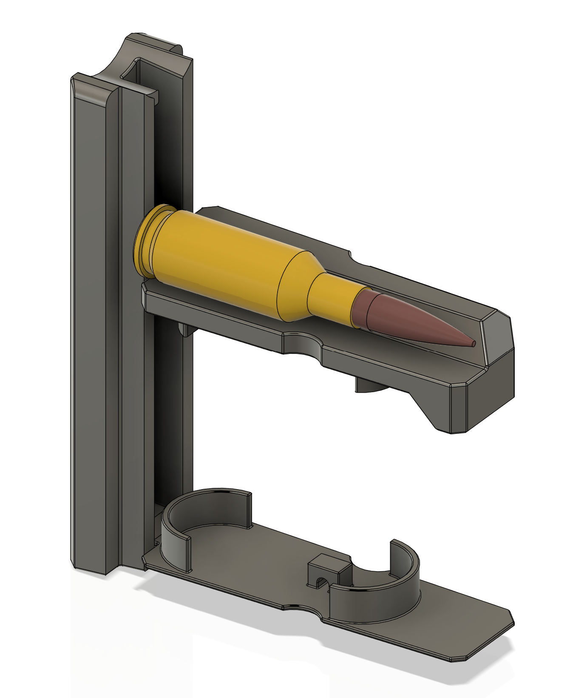

# 3D Printable 6mm BR spacer kit for AW Magazine (0726)

Similar to HRD 6mm spacer kit, this design offers STL and source file which limits the internal space for an Accuarcy International AW magazine (0726) to be able to reliably feed 6mm BR carriage.

# BOM

* 1x Magpul PMAG AC 5 spring
* 1x AW (0726) or AX/AT magazine

# Printability

Parts are oriented to the print position. You will need to enable support in order to print the follower. 

# Compatibility

The 3d printed follower allows full bolt engagement subject to the magazine feed lip. It should work with most 3 lug actions. Additional fitment and adjustment is required for common 2 lug remington clone actions.

